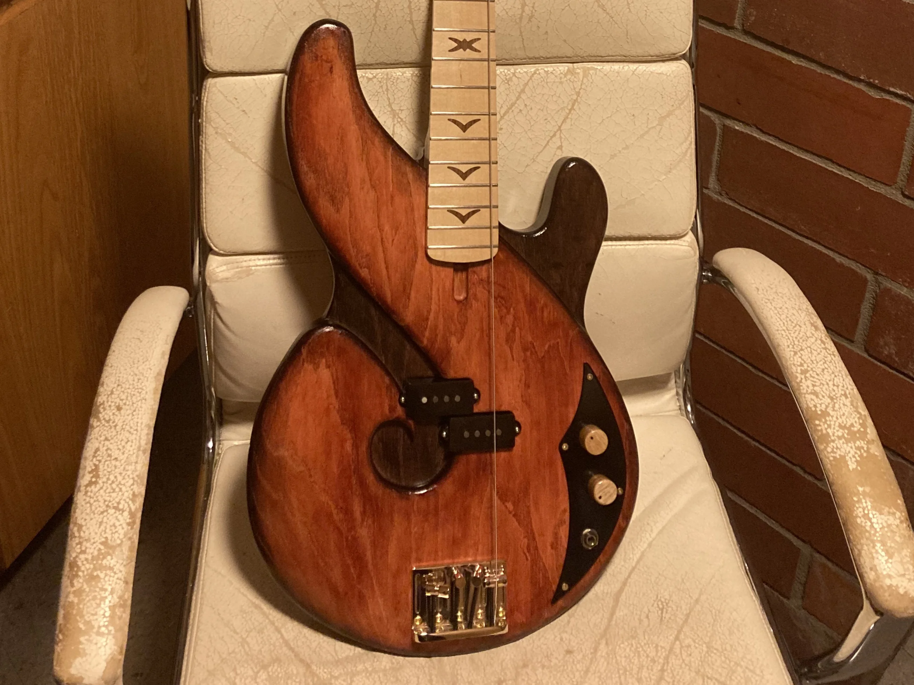

# Responsive Images Guide

## Overview
This guide shows you how to implement responsive images for efficient loading across all devices. Responsive images serve different sizes based on the user's screen, saving bandwidth and improving load times.

## What This Does

### Before (Current):
- All users download the same large image (e.g., 2MB)
- Mobile users waste bandwidth on oversized images
- Slower page load, especially on mobile

### After (Responsive):
- Mobile users get small images (e.g., 100KB)
- Tablet users get medium images (e.g., 300KB)
- Desktop users get large images (e.g., 800KB)
- Lightbox/modal shows full resolution
- **Result: 50-80% faster page loads on mobile!**

---

## Step 1: Generate Responsive Sizes

Run the batch file:
```
CREATE_RESPONSIVE_IMAGES.bat
```

This creates 5 versions of each image:

```
responsive_images/
├── thumb/      (300px)  - Gallery thumbnails
├── small/      (640px)  - Mobile phones
├── medium/     (1024px) - Tablets
├── large/      (1920px) - Desktop monitors
└── full/       (original) - Lightbox/modal view
```

---

## Step 2: Update Your HTML

### Option A: Simple `srcset` (Recommended)

Replace your current `` tags with responsive versions:

#### Before:
```html

```

#### After:
```html

```

**What this does:**
- `srcset`: Lists available image sizes with their widths
- `sizes`: Tells browser which size to use based on viewport
- `src`: Fallback for older browsers

---

### Option B: Full `<picture>` Element (Maximum Control)

For even more control (e.g., different crops for mobile):

```html
<picture>
  <source media="(max-width: 640px)" 
          srcset="responsive_images/small/bass.webp"
          type="image/webp">
  <source media="(max-width: 1024px)" 
          srcset="responsive_images/medium/bass.webp"
          type="image/webp">
  <source media="(min-width: 1025px)" 
          srcset="responsive_images/large/bass.webp"
          type="image/webp">
  
</picture>
```

---

## Step 3: Update Modal/Lightbox Images

For images that appear in modals (clicked images), use the `full/` size:

#### Before:
```html
<div id="modal-bass" class="w3-modal" onclick="this.style.display='none'">
  
</div>
```

#### After:
```html
<div id="modal-bass" class="w3-modal" onclick="this.style.display='none'">
  
</div>
```

---

## Example: Full Gallery Item Update

Here's a complete before/after example:

### Before:
```html
<div class="w3-col l3 m6 w3-margin-bottom">
  
</div>

<div id="modal-bass" class="w3-modal" onclick="this.style.display='none'">
  
</div>
```

### After:
```html
<div class="w3-col l3 m6 w3-margin-bottom">
  
</div>

<div id="modal-bass" class="w3-modal" onclick="this.style.display='none'">
  
</div>
```

---

## Understanding `sizes` Attribute

The `sizes` attribute tells the browser how much space the image will take up:

```html
sizes="(max-width: 640px) 100vw,
       (max-width: 1024px) 50vw,
       33vw"
```

Translation:
- **On screens ≤640px:** Image takes 100% of viewport width (`100vw`)
- **On screens ≤1024px:** Image takes 50% of viewport width (`50vw`)
- **On larger screens:** Image takes 33% of viewport width (`33vw`)

Adjust these based on your CSS layout!

### Common `sizes` Patterns:

**Full-width images:**
```html
sizes="100vw"
```

**Gallery with 3 columns on desktop, 2 on tablet, 1 on mobile:**
```html
sizes="(max-width: 640px) 100vw,
       (max-width: 1024px) 50vw,
       33vw"
```

**Sidebar image (always 300px max):**
```html
sizes="(max-width: 300px) 100vw, 300px"
```

---

## Performance Benefits

### Bandwidth Savings Example:
Original bass.jpg: **1.8 MB**

| Device | Size Used | File Size | Savings |
|--------|-----------|-----------|---------|
| Mobile | small (640px) | 150 KB | **92%** |
| Tablet | medium (1024px) | 350 KB | **81%** |
| Desktop | large (1920px) | 750 KB | **58%** |

**Average savings: ~75% less data transferred!**

---

## Testing Your Changes

### 1. Visual Test:
- Open your page in a browser
- Check that images load correctly
- Try different screen sizes (resize window)

### 2. Network Test:
- Open DevTools (F12)
- Go to Network tab
- Filter by "Img"
- Reload page
- Verify smaller images load on smaller viewports

### 3. Responsive Test:
- Right-click → Inspect
- Click device toolbar icon (or Ctrl+Shift+M)
- Switch between mobile/tablet/desktop views
- Watch which image sizes load in Network tab

---

## Browser Support

- **`srcset` and `sizes`:** All modern browsers (95%+ global support)
- **`<picture>`:** All modern browsers (95%+ global support)
- **`loading="lazy"`:** All modern browsers (90%+ global support)

Older browsers will fall back to the `src` attribute (still works!).

---

## Tips & Best Practices

### 1. **Use WebP Format**
- 25-35% smaller than JPEG at same quality
- All modern browsers support it
- The script already does this!

### 2. **Keep Using `loading="lazy"`**
- Delays loading images until user scrolls near them
- You're already doing this - keep it!

### 3. **Optimize the `sizes` Attribute**
- Match your actual CSS layout
- Use browser DevTools to check actual image sizes
- Adjust `sizes` if needed

### 4. **Consider Art Direction**
- For hero images, you might want different crops for mobile
- Use `<picture>` element for this (Option B above)

### 5. **Don't Over-Optimize**
- Having 5 sizes is good for most sites
- More sizes = more file management
- Focus on the most common breakpoints

---

## Automated Replacement Script (Optional)

If you have many images to update, I can create a Python script to automatically update your HTML files. Let me know if you want this!

---

## Questions?

- **Q: Will this break my existing images?**  
  A: No! Keep your original images as backup. The `src` fallback ensures old browsers still work.

- **Q: Do I need to update all images at once?**  
  A: No! Update gradually. Start with your most-viewed pages.

- **Q: What about images in other folders?**  
  A: The script only processes images in the main directory. For other folders, adjust the script or run it in each folder.

- **Q: How do I know it's working?**  
  A: Open DevTools → Network tab. On mobile viewport, you should see smaller image files loading.

---

## Next Steps

1. ✅ Run `CREATE_RESPONSIVE_IMAGES.bat`
2. ✅ Verify the `responsive_images/` folder was created
3. ✅ Update 1-2 images in your HTML as a test
4. ✅ Test in browser at different sizes
5. ✅ Update remaining images
6. ✅ Delete original images (optional - after backup!)

Happy optimizing! 🚀
